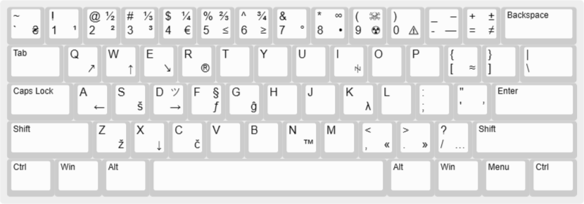

# Розкладка "US-Enhanced"

В цій розкладці є:
- стандартна розкладка англійської мови
- діакритичні літери `Ž, Š, Č, Ĝ`
- інші унікальні символи, наприклад `ꑭ, ツ`

## Інсталяція та видалення

Ця розкладка буде додана як англійська мова(English, ENG), з назвою "US-Enhanced". 

Після можна видалити стандартну англійську розкладку.

## Інформація для самостійного редагування(створення) розкладки.

Файл [us_full.klc](us-full.klc) — це розкладка клавіатури "US-Enhanced".

[<ins>Зображення візуалізації цієї розкладки для редагування.</ins>](http://www.keyboard-layout-editor.com/#/gists/6ed7422686ca1c601efe34c0a5f3234b)