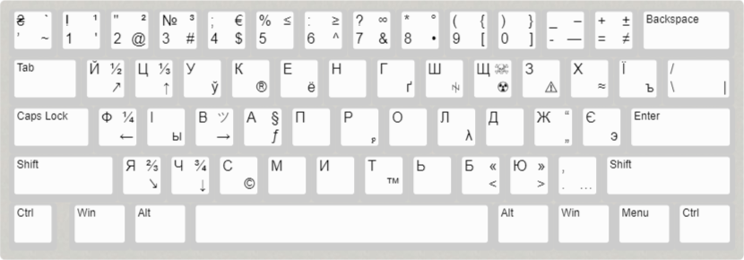

# Розкладка "UKR-Розширена(ЙЦУКЕН)"

Ця розкладка є корисною для тих, кому потрібно час від часу переключатись на інші розкладки, щоб доступитись до символів чи літер, яких немає у стандартній українській розкладці.

В цій розкладці є:
- стандартна розкладка української мови, тільки замість `'`, стоїть апостроф `’`
- унікальні літери інших розкладок:
  - московської `Ы, Ё, Ъ, Э`
  - білоруської `Ў`
- символи, до яких можна було доступитись лише через англійську розкладку
- інші унікальні символи, наприклад `ꑭ, ツ, ₚ`

## Інсталяція та видалення

Ця розкладка буде додана як українська мова(Ukrainian, UKR), із назвою "UKR-Розширена". 

Після можна видалити стандартну українську розкладку. Якщо присутня московська мова, її також можна видалити, так як надана розкладка містить у собі всі унікальні символи цієї мови. Так само з білоруською мовою.

## Інформація для самостійного редагування(створення) розкладки.

Файл [ukr_full.klc](ukr_full.klc) — це розкладка клавіатури "UKR-Розширена".

__Пропозиція:__ якщо ви використовуєте букву `ґ` частіше ніж зазвичай і хочете приділити цій букві окреме місце, можна її поставити на місці знаку `\`, та `Ґ` замість `/`. Далі ці знаки змістити, один знак доведеться перекинути на іншу клавішу, наприклад `/` поставити на клавішу, яка відповідає за неї в англійській розкладці, в українській розкладці це клавіша з символами `"."` та `","`.

[<ins>Зображення цієї розкладки для редагування.</ins>](http://www.keyboard-layout-editor.com/#/gists/1b2f282604da049b383f3763a1a1713d)