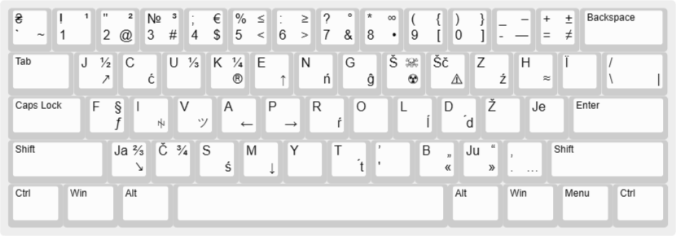

# Розкладка "UKR-Latynka(JCUKEN)"

Перед ознайомленням з матеріалом який тут наведено, раджу ознайомитись із [цим матеріалом](../latyn_ua_Max_Prudeus/README_Max_Prudeus.md) та тими покликаннями, які там залишено.

В цій розкладці є:

- транслітерація кожної букви, окрім `Ї`, яку я лишив
- тверді з діактрикою, пом'якшені версії твердих `Ć, Ń, Ź, Ŕ, Ĺ, D́, Ś, T́`
- інші унікальні символи, наприклад `ツ, ꑭ`

Цю клавіатуру можна використовувати за різними правописами української латинки, в тому числі за правописом Максима Прудеуса.

## Мій варіант правопису латинкою

Тут вкладено зміни правопису [Максима Прудеуса](../latyn_ua_Max_Prudeus/README_Max_Prudeus.md). Зміни стосуються застосування йотованих літер та м'якого знаку.

> __Пом'якшення:__ для пом'якшення літери можна використати `'`, або скористатись одразу пом'якшеною літерою з діакритикою: `Ć, Ń, Ź, Ŕ, Ĺ, D́, Ś, T́`.

Для відображення йотованої `Я(Ja), Ю(Ju), Є(Je), Ї(Ї або Ji)` в латиниці, які стоять в кирилиці після:

- апострофу після приголосних для розділення(в'я, к'я і т.д.) та після голосної, можна обійтись без апострофу.

- твердої літери для пом'якшення(тя, дя і т.д.), можна скористатись __пом'якшенням__, після друкувати голосну складову літеру йотованої літери.

- м'якого знаку, можна скористатись __пом'якшенням__ після друкувати йотовану літеру.

По факту, потреба в апострофі просто зникне.

## Приклад

Šče ne vmerla Ukraїna, ni slava ni voĺa 
Šče nam bratt́a ukraїnci, usmihnet́śa doĺa 
Zgynut́ naši vorižeńki, jak rosa na sonci 
Zapanujem i my bratt́a, u svoїj storonci

Dušu j tilo my položym za našu svobodu 
I pokažem, ščo my bratt́a, kozaćkogo rodu

## Варіанти редагування розкладки

Так само як і в розширеній українській розкладці, можна `ĝ` та `Ĝ` поставити на місце `\` та `/` відповідно. Далі ці знаки змістити, один знак доведеться перекинути на іншу клавішу.

Можна переназначити клавішу `Ї` на `Ji`. Також я бачив варіант використання `Ł` для `Л` та `L` для пом'якшеної `Ль`.

Можна додати подвоєні літери, як `нн` та `тт`. Відповідники в латинській можете собі підібрати.

Якщо ви хочете постійно друкувати пом'якшені тверді за допомогою діакритичних знаків замість додавання `'`, буде не дуже зручно друкувати постійно за допомогою комбінації з `AltGr`. Можна задати автоматичну заміну, наприклад `T' → T́, D' → D́` і т.д.

Для латинських йотованих, які складаються з двох літер, виділені окремі місця, там ж де вони і в кириличній версії. Можна звільнити ці місця, так як їх можна друкувати із `J` + голосна складова. На ці ж місця можна поставити наприклад пом'якшені літери, якщо варіант автозаміни вам не підходить. Або взагалі задати кириличні йотовані `Я, Ю, Є, Ї`, тоді потреба в пом'якшених літерах не знадобиться і правила використання йотованих будуть ті ж самі, що і в кирилиці, що правда, тоді цю розкладку латиничною назвати буде не можна, зате вона буде унікальною.

## Інсталяція

Ця розкладка буде додана як українська мова(Ukrainian, UKR), з назвою "UKR-Latynka". 

Сама розкладка не буде заважати при переключенні на іншу мову. Зі звичайною укр розкладкою можна буде переключатись за допомогою комбінації клавіш `Ctrl+Shift` при включеній укр мові.

## Інформація для самостійного редагування(створення) розкладки.

Файл [ukr_latynka.klc](ukr_latynka.klc) — це розкладка клавіатури "UKR-Latynka".

[<ins>Зображення візуалізації цієї розкладки для редагування.</ins>](http://www.keyboard-layout-editor.com/#/gists/198e2067aaf0902691116309999198f7)