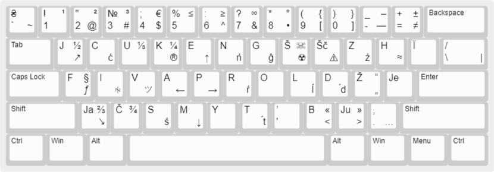

# Розкладка "UKR-Latynka(JCUKEN)"

Перед ознайомленням з матеріалом який тут наведено, раджу ознайомитись із [цим матеріалом](../latyn_ua_Max_Prudeus/README_Max_Prudeus.md) та тими покликаннями, які там залишено.

В цій розкладці є:

- транслітерація кожної букви, окрім `Ї`, яку я лишив
- символи на клавішах цифр такі, як в українські розкладці, окрім `'`, так як тут цей символ грає роль `ь`. На його місце залишено `` ` ``, яка стоїть на цій клавіші в англійській розкладці
- так як в розширеній українській розкладці, тут додано всі символи з англійської розкладки
- тверді з діакритикою — пом’якшені версії твердих: `Ć, Ń, Ź, Ŕ, Ĺ, D́, Ś, T́`
- інші унікальні символи, наприклад `ツ, ꑭ`

Цю розкладку можна використовувати за різними правописами української латинки, в тому числі за правописом Максима Прудеуса.

## Мій варіант правопису латинкою

Тут вкладено зміни правопису [Максима Прудеуса](../latyn_ua_Max_Prudeus/README_Max_Prudeus.md). Зміни стосуються застосування йотованих літер та м’якого знаку.

> __Пом’якшення:__ для пом’якшення літери можна використати `'`, або скористатись одразу пом’якшеною літерою з діакритикою: `Ć, Ń, Ź, Ŕ, Ĺ, D́, Ś, T́`.

Для відображення йотованої `Я(Ja), Ю(Ju), Є(Je), Ї(Ї або Ji)` в латиниці, які в кирилиці стоять:

- після апострофу для розділення(в’я, к’я і т.д.), можна обійтись без апострофу. 
Приклад: м’ясо = mjaso, вар’ят = varjat, бур’ян = burjan

- для пом’якшення(тя, дя і т.д.), можна скористатись __пом’якшенням__, після друкувати голосну складову йотованої літери. 
Приклад: сьомга = śomga/s'omga, браття = bratt́a/bratt'a

> __Примітка:__ в цьому правописі, `J` не пом’якшує, а `'` не виконує функцію апострофа. `'` використовується замість м’якого знаку та для пом’якшення, замість йотованих. Тобто: кальян = kaĺjan/kal'jan

## Приклад

Šče ne vmerla Ukraїny ni slava, ni voĺa. 
Šče nam, bratt́a molodiї, usmihnet́śa doĺa. 
Zgynut́ naši vorižeńky, jak rosa na sonci, 
Zapanujem i my bratt́a, u svoїj storonci.

Dušu j tilo my položym za našu svobodu, 
I pokažem, ščo my, bratt́a, kozaćkogo rodu.

## Інсталяція

Ця розкладка буде додана як українська мова(Ukrainian, UKR), із назвою "UKR-Latynka". 

Сама розкладка не буде заважати при переключанні на іншу мову. Зі звичайною українською розкладкою можна буде переключатись за допомогою комбінації клавіш `Ctrl+Shift` при включеній українській мові.

## Інформація та пропозиції для самостійного редагування(створення) розкладки.

Файл [ukr_latynka.klc](ukr_latynka.klc) — це розкладка клавіатури "UKR-Latynka".

Так само як і в розширеній українській розкладці, можна `ĝ` та `Ĝ` поставити на місце `\` та `/` відповідно. Далі символи `\, /, |` перепризначити на інші комбінації, але один знак доведеться перепризначити на іншу клавішу. Наприклад `/` можна призначити на клавішу, яка відповідає за неї в англійській розкладці.

Можна переназначити клавішу `Ї` на `Ji`. Також я бачив варіант використання `Ł` як `Л` та `L` як пом’якшеної `Ль`.

Можна додати подвоєні літери, як `нн` та `тт`. Відповідники в латинській можете собі підібрати.

Якщо ви хочете постійно друкувати пом’якшені тверді за допомогою діакритичних знаків замість додавання `'`, буде не дуже зручно друкувати постійно за допомогою комбінації з `AltGr`. Можна задати автоматичну заміну, наприклад `T' → T́, D' → D́` і т.д.

Для йотованих, які в українській латиниці складаються з двох літер, виділені окремі клавіші, там само, де вони і в кириличній розкладці. Можна звільнити ці місця, так як їх можна друкувати із `J` + голосна складова. На ці ж місця можна призначити наприклад пом’якшені літери, якщо варіант автозаміни вам не підходить. Або взагалі задати кириличні йотовані, тоді потреба в пом’якшених літерах не знадобиться і правила використання йотованих будуть ті ж самі, що і в кирилиці, що правда, тоді цю розкладку латиничною назвати буде не можна, зате вона буде унікальною.

[<ins>Зображення цієї розкладки для редагування.</ins>](http://www.keyboard-layout-editor.com/#/gists/198e2067aaf0902691116309999198f7)