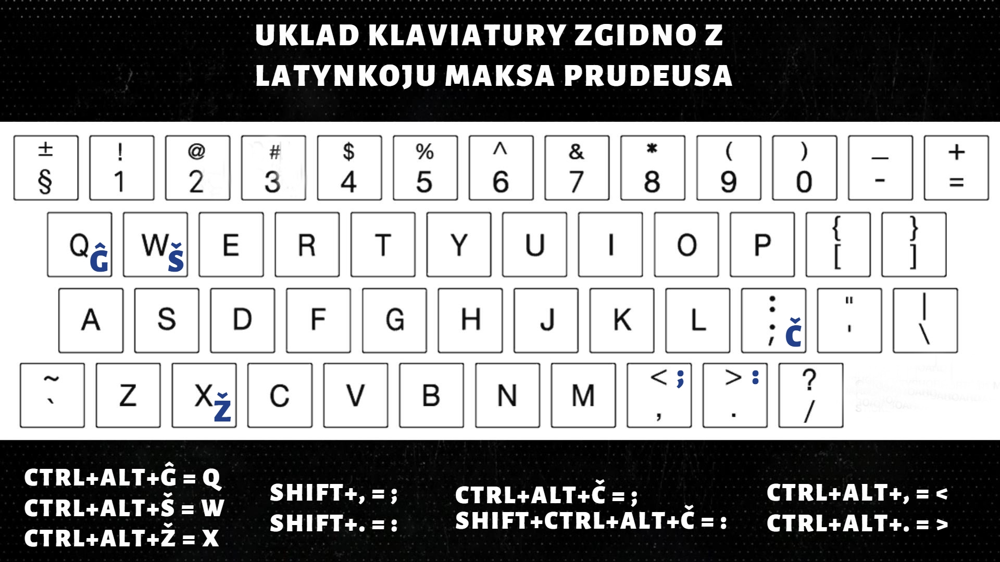
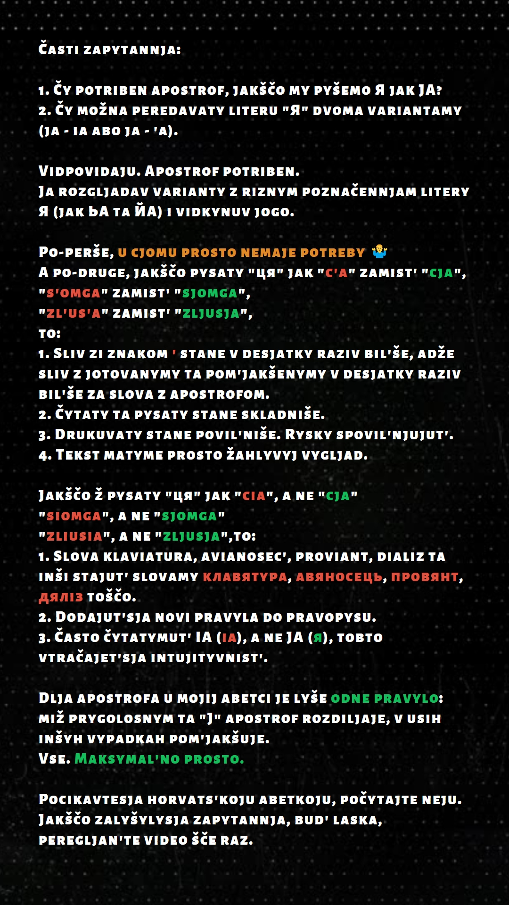

# Латинський уклад української мови від Максима Прудеуса "UA-Latynka(ĜŠERTY)"

Раджу ознайомитись з цією розкладкою та інформацією про українську латинку у цьому [відео](https://www.youtube.com/watch?v=nHeE2x2UNw4). 
Оригінал розкладки взято [тут](https://drive.google.com/drive/folders/1h1pUOOd8DRGtQFtvmpVLDd41bzc7DjRe). 
Наведена далі інформація може потребувати додаткових пояснень, якщо ви не ознайомились з інформацією за покликаннями, які наведені зверху.

## Абетка

## Відповідність літер абетки

## FAQ

## Приклад

Šče ne vmerla Ukrajiny ni slava, ni volja. 
Šče nam, brattja molodiji, usmihnet'sja dolja. 
Zgynut' naši vorižen'ky, jak rosa na sonci, 
Zapanujem i my, brattja, u svojij storonci.

Dušu j tilo my položym za našu svobodu, 
I pokažem, ščo my, brattja, kozac'kogo rodu.

## Інсталяція

Уклад встановлюється як хорватська мова(Croatian, HRV), із назвою "UA-Latynka".