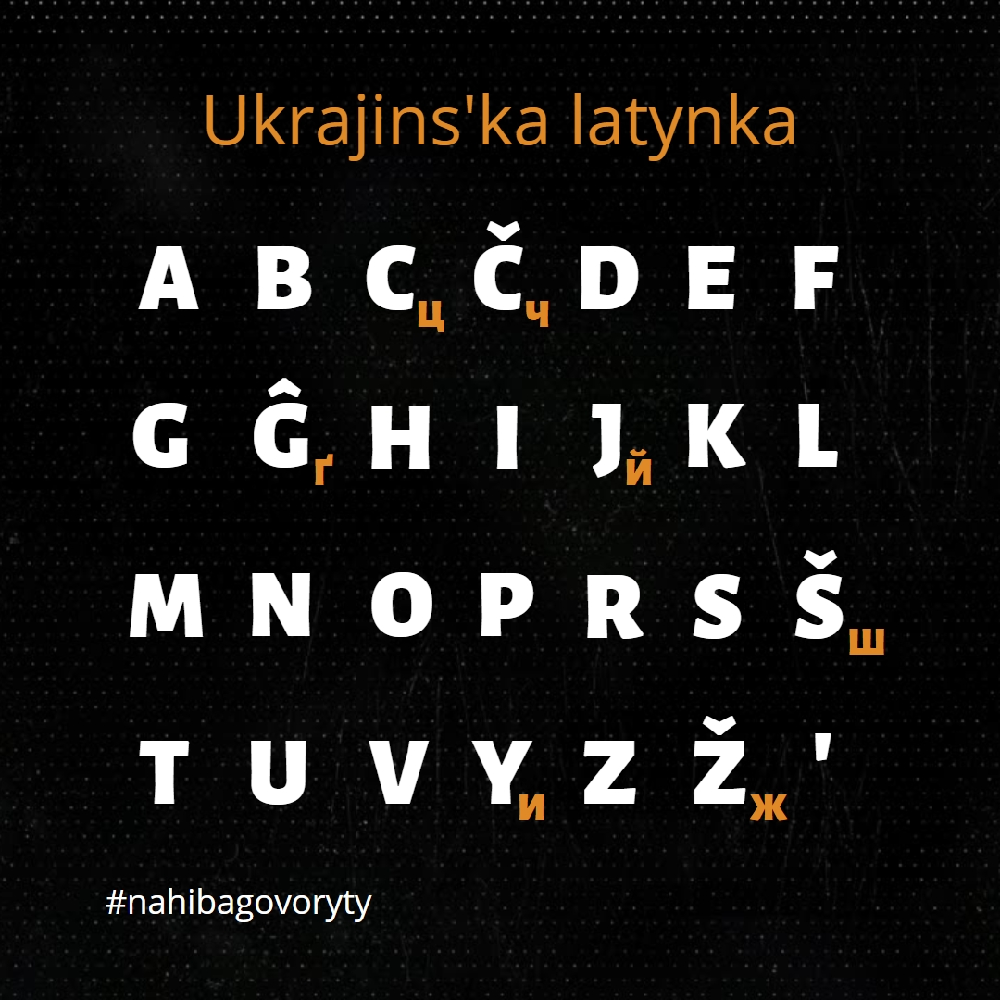
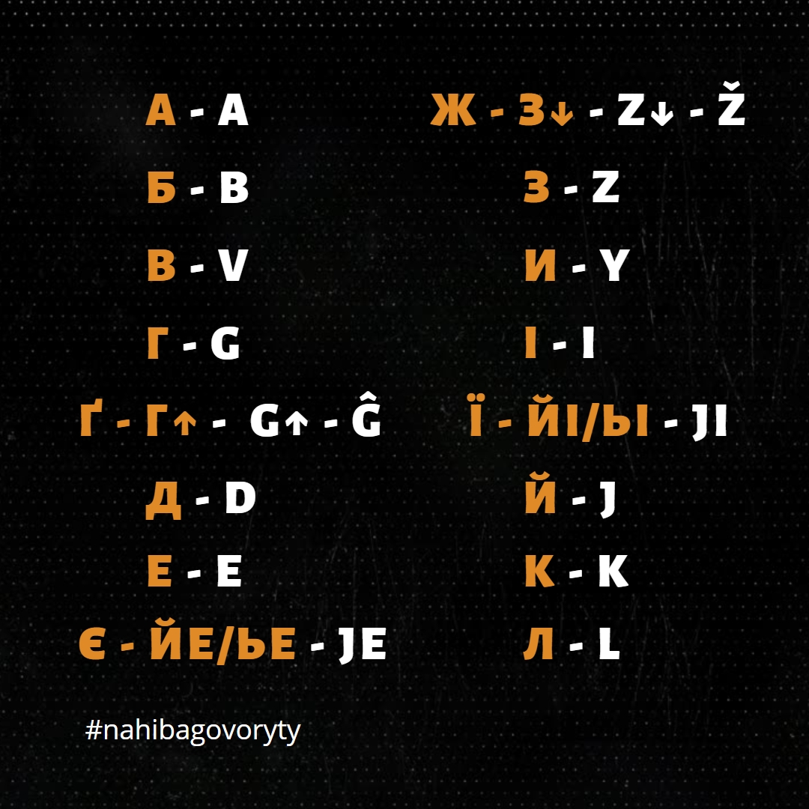
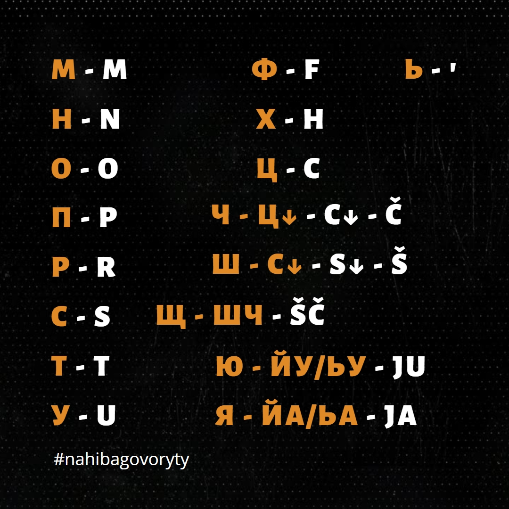

# Латинський уклад української мови від Максима Прудеуса

Раджу ознайомитись з цією розкладкою та інформацією про українську латинку у цьому [відео](https://www.youtube.com/watch?v=nHeE2x2UNw4). 
Оригінал розкладки взято [тут](https://drive.google.com/drive/folders/1h1pUOOd8DRGtQFtvmpVLDd41bzc7DjRe). 
Наведена далі інформація може потребувати додаткових пояснень, якщо ви не ознайомились з інформацією за покликаннями, які наведені зверху.

## Інсталяція

Уклад встановлюється як хорватська мова(Croatian, HRV) із назвою "UA-Latynka".

## Абетка

## Відповідність символів абетки

## FAQ

